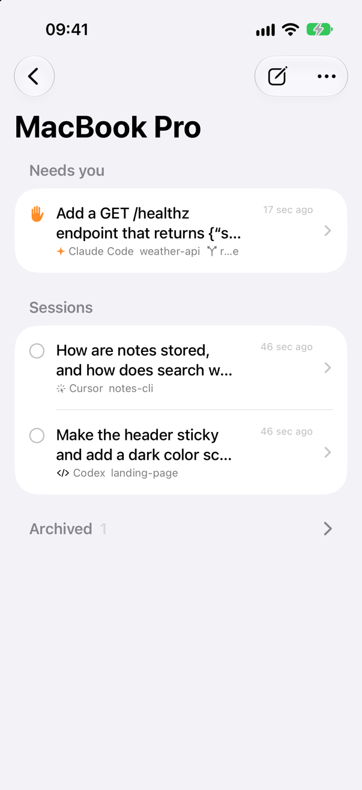
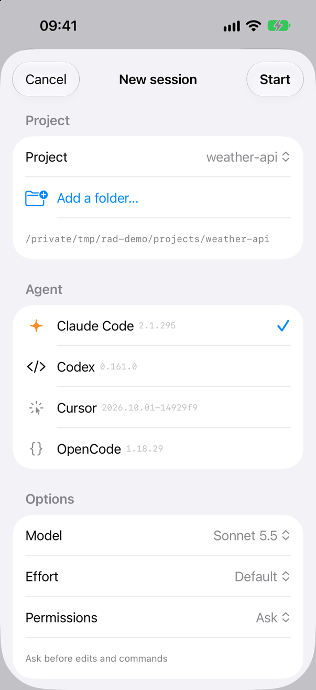
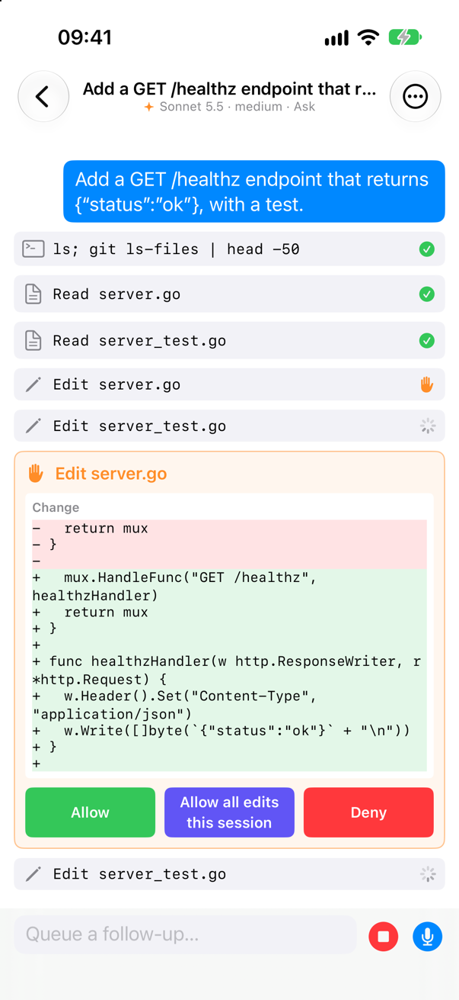
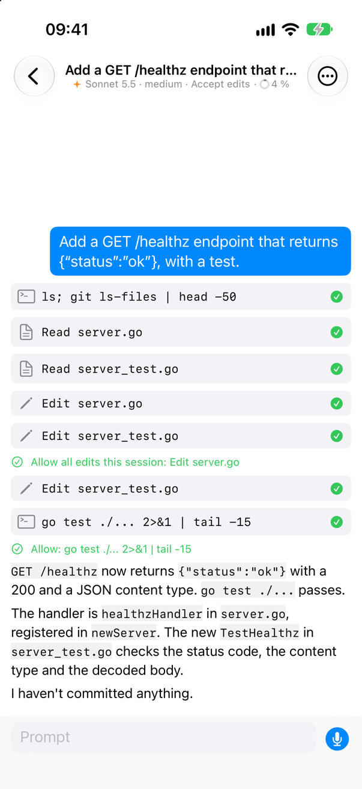
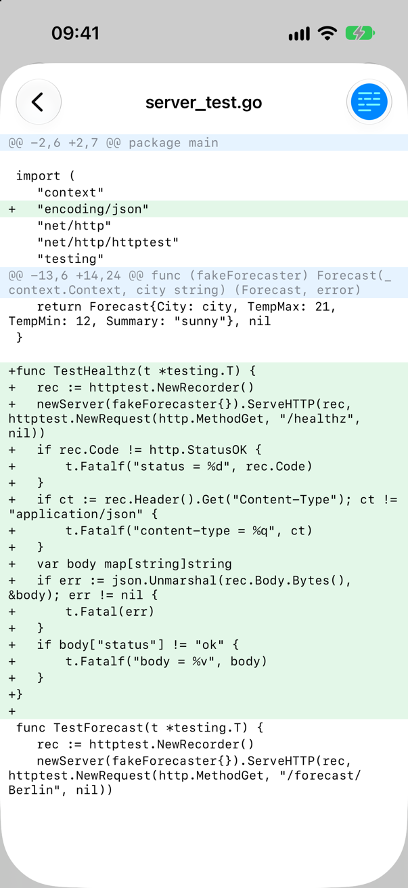

# Remote Agent

Drive coding agents running on your computer from your iPhone or iPad.

- **`rad`**: a Go server that runs on the dev machine. It spawns agent CLIs as child processes, normalizes what they do into one event model, persists it in SQLite, and serves it over a WebSocket.
- **Remote Agent**: a native SwiftUI app for iPhone and iPad. You pair it by QR code. On iPad, a server's sessions stay in a sidebar next to the one you have open. From the app you can:
  - start sessions in any project
  - watch agents stream their work
  - dictate prompts, in any of your keyboard languages
  - approve or deny tool calls
  - answer the agent's questions
  - review per-turn git diffs and revert them

<p>
  
  
  
  
  
</p>

Supported harnesses:

| Harness | How rad talks to it |
|---|---|
| Claude Code | `claude --input-format stream-json --output-format stream-json --permission-prompt-tool stdio`: the same control protocol the Agent SDKs use |
| Codex | `codex app-server` (JSON-RPC over stdio) |
| Pi | `pi --mode rpc` (JSON commands and events over stdio) |
| Cursor, OpenCode, Gemini, Oh My Pi, … | [Agent Client Protocol](https://agentclientprotocol.com): `cursor-agent acp`, `opencode acp`, `gemini --acp`, `omp acp` (configurable) |

Prior art: [Happy](https://github.com/slopus/happy) (mobile client and relay for Claude Code) and [T3 Code](https://github.com/pingdotgg/t3code) (local server that owns agent processes, worktrees and checkpoints).

## Quick start

The server lives in `server/` and builds into `server/bin/rad`:

```bash
cd server
go build -o bin/rad ./cmd/rad
./bin/rad serve          # first run writes ~/.config/remote-agent/config.yaml and prints a pairing QR
```

On the phone, open Remote Agent and tap **Pair a server**, then scan the QR code. In the simulator, paste the link from `rad pair --print-url` instead.

`rad serve` and `rad pair` list the agents that are ready, and any installed agent that still needs a login. The phone only sees agents installed on the server.

rad listens on all interfaces (`0.0.0.0:7421`). The pairing link tells the phone which addresses to try:

- **Tailscale (recommended):** the Tailscale address (100.x) is in the link by default, and WireGuard encrypts the traffic.
- **Same Wi-Fi:** run `rad serve --lan` / `rad pair --lan`, or set `lan = true` in the config, to add the LAN addresses too. Traffic on the LAN is plain HTTP.
- **Your own choice:** set `pair_urls` in the config to put exactly those addresses in the link, in that order, e.g. a Tailscale MagicDNS name or one specific LAN IP. Plain `http://` works with IP addresses, `.local` names and `*.ts.net`; any other host name needs `https://`.

To keep rad running in the background:

```bash
./bin/rad install-service          # --uninstall to remove
```

- **macOS:** a LaunchAgent that starts at login. Logs go to `~/Library/Logs/rad.log`.
- **Linux:** a systemd user unit, `remote-agent.service`. Read the logs with `journalctl --user-unit remote-agent -f`.
  - rad turns on lingering for your user, so it starts at boot and keeps running after you log out. Without polkit (as on a minimal Debian server) that needs root: run `sudo loginctl enable-linger $USER` first.
  - Run it from a login of that user, e.g. over SSH, not through `su` or `sudo`.

Both capture your current `PATH`, so rad finds the agent CLIs the way your shell does. Run `install-service` again after rebuilding rad, or after installing an agent CLI somewhere new.

To remove rad completely, run `./bin/rad uninstall`. It lists everything first and asks before removing. It removes:
- the service
- the config
- the data: the database, logs and session worktrees (uncommitted changes in them are lost)
- the `refs/ra/*` checkpoints in your project repos

It keeps the session branches and the rad binary.

## Installing the app on an iPhone or iPad

You need an iPhone or iPad on iOS 27 or later, Xcode, an Apple ID and, for the first run, a cable.

- **Free Apple ID:** builds expire after 7 days; run from Xcode again to renew.
- **Paid Developer Program membership:** builds last a year.

1. In Xcode → Settings → Accounts, add your Apple ID.
2. Generate and open the project (commands here run from the repo root):

   ```bash
   (cd ios && xcodegen) && open ios/RemoteAgent.xcodeproj
   ```

3. Select the **RemoteAgent** target → Signing & Capabilities, and choose your team.
   - If Xcode says the bundle ID is taken, see step 4.
   - xcodegen regenerates the project and forgets this choice. Save the team in the gitignored `ios/Local.xcconfig` so it survives:

     ```bash
     grep -m1 -o 'DEVELOPMENT_TEAM = [A-Z0-9]*' ios/RemoteAgent.xcodeproj/project.pbxproj > ios/Local.xcconfig
     ```

4. If the bundle ID was taken, add `PRODUCT_BUNDLE_IDENTIFIER = com.yourname.remote-agent` to `ios/Local.xcconfig`, then run `xcodegen` again.
5. Prepare the device:
   1. Connect it, unlock it and tap **Trust**.
   2. Turn on Settings → Privacy & Security → **Developer Mode**. The switch appears once Xcode has seen the phone, and turning it on restarts the phone.
6. Pick the device as the run destination and press ⌘R.
   - With a free Apple ID, the first launch is blocked until you trust yourself as a developer: Settings → General → VPN & Device Management → your Apple ID → Trust.
   - After the first run, Xcode can also install over Wi-Fi.
7. Make sure the phone can reach the computer. Use Tailscale, or set `lan = true` for the same Wi-Fi (see Quick start).
8. Pair the phone:
   1. Run `server/bin/rad pair` on the computer. Add `--lan` if the phone will connect over Wi-Fi rather than Tailscale.
   2. In the app, tap **Pair a server** (or **+**) and scan the QR code. The Camera app can scan it too.
   3. Allow Local Network access when iOS asks.

The app icon is drawn by `ios/scripts/make-app-icon.swift`. Run it again after changing it:

```bash
cd ios && swift scripts/make-app-icon.swift RemoteAgent/Assets.xcassets/AppIcon.appiconset
```

## Using it

- **New session:**
  1. Pick a project folder; you can browse anything under `roots` from the config.
  2. Pick an agent, a model, an effort and a permission mode. The app remembers what you last started each agent with.
  3. Optionally choose **Isolated git worktree**, which puts the agent on its own branch in `~/Library/Application Support/remote-agent/worktrees/…`.
  4. Write the first prompt, or leave it empty to open the session and write it there.
- **Approvals:** cards appear inline. The buttons come from the agent itself, e.g. *Allow*, *Allow all edits this session*, *Deny*. When denying, you can give the agent a reason.
  - Pi doesn't ask before running tools. Oh My Pi asks only clients that run its file and terminal tools for it, which rad doesn't, so expect no approvals from it either.
  - Pi extensions can still ask: their yes/no and multiple-choice dialogs show up as cards, e.g. from Pi's example `permission-gate.ts`. The app can't answer their free-text prompts yet, so those are cancelled.
- **Questions and plans:** Claude's `AskUserQuestion` and `ExitPlanMode` show up as choice and plan cards.
- **Changes:** rad snapshots the workspace before and after every turn into hidden git refs (`refs/ra/cp/…`), without touching your index or HEAD. You can view each turn's diff or the whole session's.
- **Revert:** in worktree sessions you can revert to before any turn. The agent is told about it on the next prompt.
- **Stop:** this interrupts the current turn. *Force stop* kills the agent process. Idle agents are stopped after `idle_timeout` and resume transparently on the next prompt.

## CLI

```
rad serve [--lan] [--fake] [-v]   run the server (--fake adds a scripted test harness)
rad pair [--lan] [--print-url]    new single-use pairing code (10 min) and the agents that are ready; --lan adds LAN addresses to the link
rad devices                       list paired devices
rad devices revoke <id-prefix>    revoke one; its open connections close within 30s
rad install-service [--uninstall]  run rad in the background (launchd on macOS, systemd on Linux)
rad uninstall [--yes]             remove the service, config, data, worktrees and checkpoints
rad debug run --harness claude --cwd DIR [--mode M] [--model M] [--effort E] [--worktree] [--approve] [--diff] "prompt"
rad debug prompt <sessionId> "…"  follow-up turn, streamed to the terminal
rad debug call <method> '{json}'  raw RPC (see protocol/PROTOCOL.md)
```

## Configuration

`~/.config/remote-agent/config.yaml`. Data lives in `~/Library/Application Support/remote-agent` on macOS and `~/.local/share/remote-agent` on Linux. Set `RAD_HOME=/some/dir` to keep the config and data together, e.g. for tests.

```yaml
name: Work laptop               # what the app calls this server after pairing (default: host name)
port: 7421
lan: false                      # also put LAN addresses in the pairing link
# pair_urls: [my-mac.tail1234.ts.net, 192.168.1.20]   # or list the link's addresses yourself
                                # (bare hosts get http:// and the port; also host:port, https://…)
# listen: ["127.0.0.1:7421", "100.101.102.103:7421"]  # bind only these instead of 0.0.0.0
roots: [~/projects]             # what the phone may browse and add as projects ("~" in quotes for home itself)
idle_timeout: 30m
acp:                            # any ACP agent can be added here
  - {id: cursor,   name: Cursor,   command: cursor-agent, args: [acp]}
  - {id: opencode, name: OpenCode, command: opencode,     args: [acp]}
  - {id: gemini,   name: Gemini,   command: gemini,       args: [--acp]}
  - {id: omp,      name: Oh My Pi, command: omp,          args: [acp]}
harness:
  claude: {command: claude}     # optional: args: [...], env: {KEY: value}
  codex: {command: codex}
  pi: {command: pi}             # e.g. args: [-e, /path/to/extension.ts] to load an extension
```

Unknown keys are errors, so a typo stops rad with the line number rather than being ignored.

## Security model

- A paired device can make agents run arbitrary commands on your machine. Treat device tokens like SSH keys.
- rad listens on all interfaces, but every request except pairing needs a device token. To keep it off other networks entirely, set `listen` to loopback and your Tailscale address.
- Pairing codes are single-use and expire after 10 minutes.
- Tokens are 256-bit random values. Only their SHA-256 hash is stored, and the phone keeps the token in the Keychain.
- Revoking a device closes its live sockets.
- The phone can browse and add only folders under `roots`.
- Permission modes are enforced by each agent itself. rad never auto-approves on the agent's behalf.
- Pi has no permission modes: it runs tools without asking.

## Layout

```
server/                  Go module for rad
  cmd/rad/               CLI: serve, pair, devices, debug, install-service, uninstall
  internal/model         domain types (Session, Turn, Item, Event…) = wire format
  internal/store         SQLite; per-stream change feed (latest event per entity)
  internal/events        live fan-out to subscribers
  internal/orchestrator  session actors: prompts, approvals, turns, checkpoints, recovery
  internal/harness/      adapter interface + claude/ codex/ pi/ acp/ fake/ proc/ jsonrpc/
  internal/gitx          worktrees, checkpoints, diffs, revert (git CLI)
  internal/api           HTTP pairing + WebSocket JSON-RPC
protocol/                PROTOCOL.md + golden fixtures shared by Go and Swift tests
ios/                     XcodeGen project; RAKit (protocol, client, stores) + SwiftUI app
```

## Development

```bash
cd server && go test ./... -race              # server tests (adapters replay recorded CLI transcripts)
cd server && go test ./internal/api -update   # regenerate protocol/fixtures after changing wire types
cd ios/RAKit && swift test                    # client protocol and sync tests
cd ios && xcodegen && xcodebuild -scheme RemoteAgent -destination 'platform=iOS Simulator,name=iPhone 17' build
```

To exercise the UI without spending tokens, run `rad serve --fake` and pick **Fake (scripted)**. Its prompt keywords are:
- `write <file>`: asks for approval, then writes the file
- `question`: asks a multiple-choice question
- `slow`: streams slowly, useful for testing interrupt
- `fail`: makes the turn fail

The raw protocol frames for each session are logged to `<data>/logs/<sessionId>.ndjson`.
